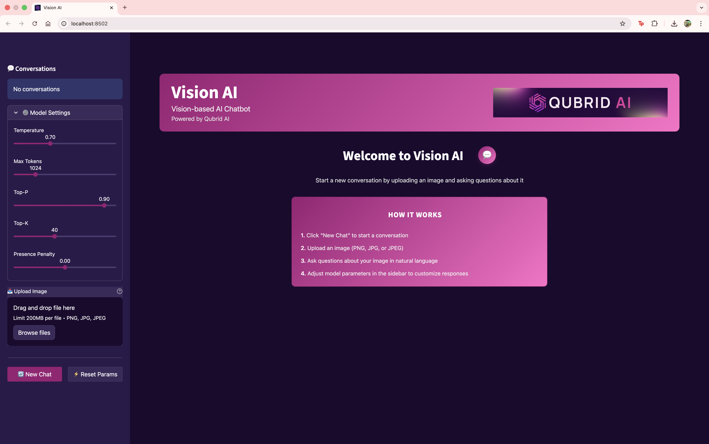
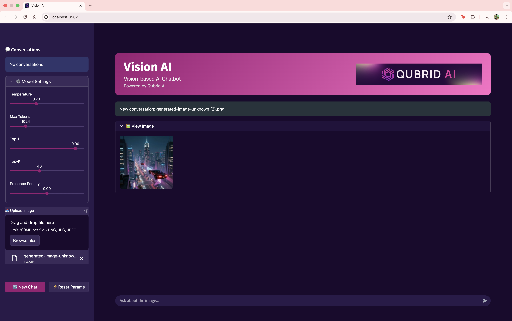
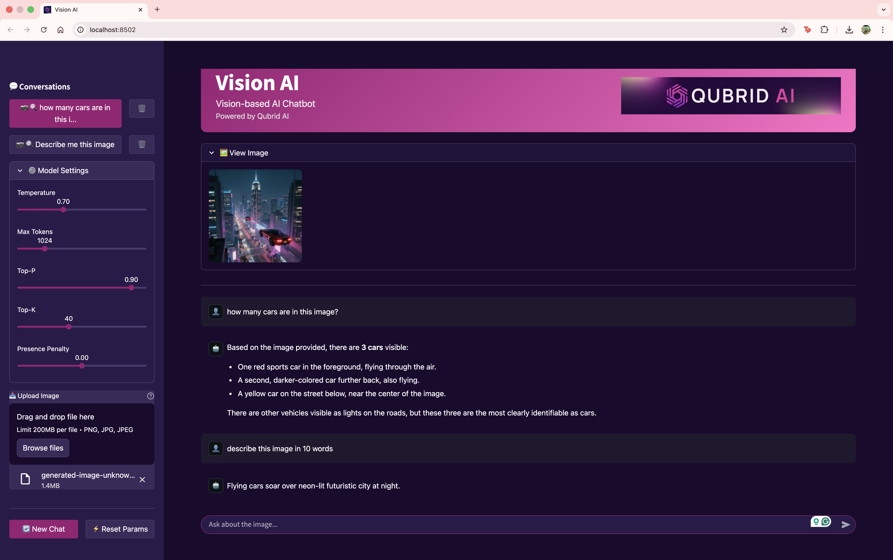
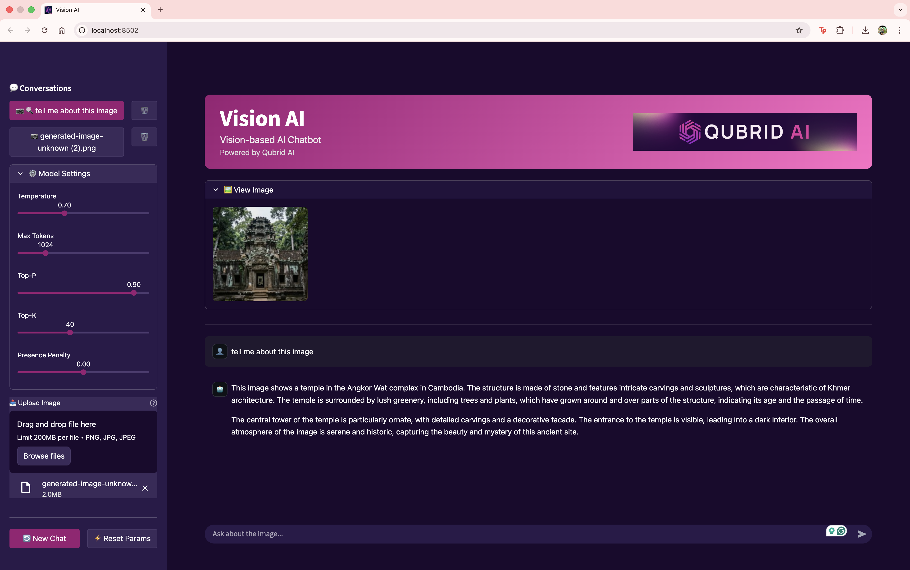
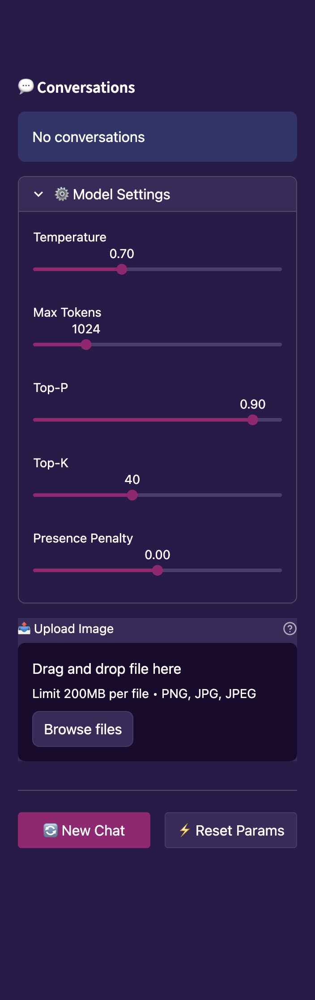
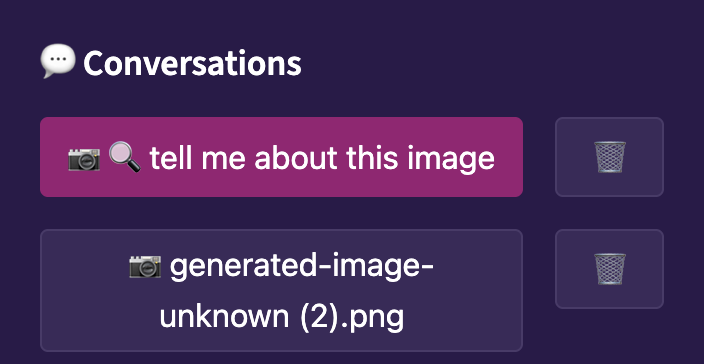
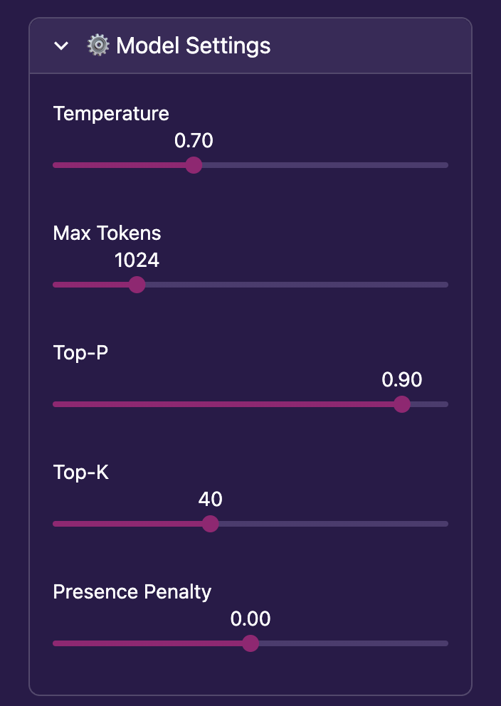
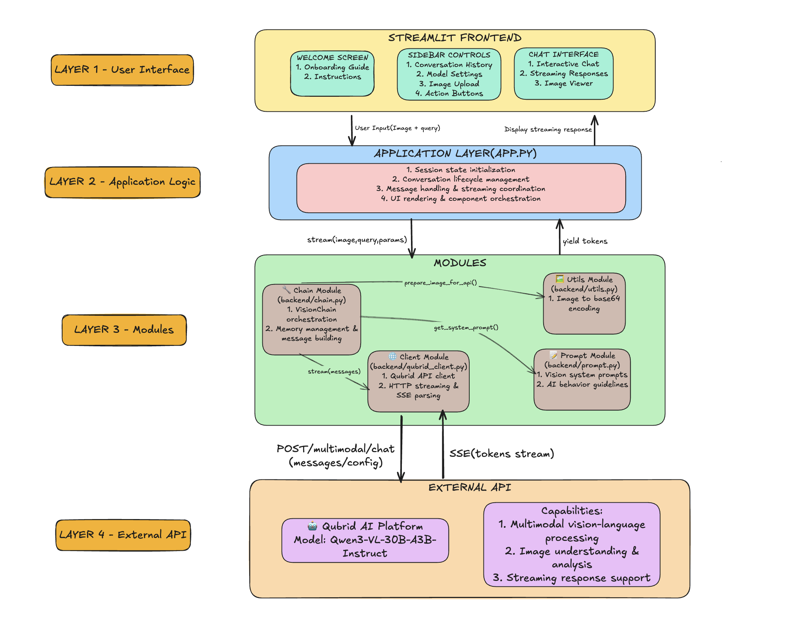

<div align="center">
  
</div>

# Vision AI Chat

> A production-ready vision-based chatbot powered by Qubrid AI's advanced vision model Qwen3-VL-30B-A3B-Instruct

[](https://www.python.org/downloads/)
[](https://streamlit.io)
[](https://langchain.com)

## Overview

Vision AI Chat is a conversational AI application that enables natural language interactions about images using Qubrid's Qwen3-VL-30B-A3B-Instruct vision model. Built with LangChain and Streamlit, it provides a clean, intuitive interface for vision-based question answering with full conversation history management.

### Key Features

- **Vision-Based Chat**: Ask questions about uploaded images using state-of-the-art vision AI
- **Conversation Management**: Multiple conversation threads with automatic context preservation
- **Streaming Responses**: Real-time token streaming for responsive user experience
- **Model Configuration**: Adjustable temperature, max tokens, top-p, top-k, and presence penalty
- **Memory Management**: LangChain-powered conversation memory with proper context handling
- **Clean Architecture**: Separation of concerns between UI state and model context

## Prerequisites

- Python 3.8 or higher
- Qubrid AI API key ([Get your key](https://qubrid.ai))
- Virtual environment (recommended)

## Installation

### 1. Clone the Repository

```bash
git clone <repository-url>
cd Vision-AI-Chatbot
```

### 2. Create Virtual Environment

```bash
python -m venv venv
source venv/bin/activate  # On Windows: venv\Scripts\activate
```

### 3. Install Dependencies

```bash
pip install -r requirements.txt
```

### 4. Configure Environment

Create a `.env` file in the project root:

```env
QUBRID_API_KEY=your_api_key_here
QUBRID_API_BASE=https://platform.qubrid.com/api/v1/qubridai/multimodal/chat
```

## Usage

### Running the Application

```bash
streamlit run app.py
```

The application will be available at `http://localhost:8501`

### Basic Workflow

1. **Upload Image**: Click the file uploader and select an image (PNG/JPG)
2. **Ask Questions**: Type your question in the chat input
3. **View Response**: Watch the AI's response stream in real-time
4. **Continue Conversation**: Ask follow-up questions with full context
5. **Manage Conversations**: Switch between conversations or start new ones from the sidebar

## UI Screenshots

Experience the clean, modern interface of Vision AI Chat:

### Homepage


### Image Upload


### Chat Interface




### Sidebar Controls


### Conversation History


### Model Settings


## Architecture



## API Integration

### Qubrid Vision Model

This application uses Qubrid's Qwen3-VL-30B-A3B-Instruct model via their API:

- **Model**: `Qwen3-VL-30B-A3B-Instruct`
- **Capabilities**: Vision understanding, multi-turn conversation, detailed image analysis
- **Input**: Text + Image (base64 encoded)
- **Output**: Streaming text responses
- 
### Technology Stack

- **Frontend**: Streamlit
- **AI Orchestration**: LangChain
- **Vision Model**: Qubrid Qwen3-VL-30B-A3B-Instruct
- **Image Processing**: Pillow
- **Environment Management**: python-dotenv


### Model Parameters

Adjust these parameters in the sidebar to control model behavior:

- **Temperature** (0.0 - 2.0): Controls randomness. Lower = focused, Higher = creative
- **Max Tokens** (256 - 4096): Maximum response length
- **Top-P** (0.0 - 1.0): Nucleus sampling threshold
- **Top-K** (1 - 100): Number of top tokens to consider
- **Presence Penalty** (-2.0 - 2.0): Penalizes topic repetition

## Project Folder Structure

```
Vision-AI-Chatbot/
├── app.py                          # Main Streamlit application entry point
├── requirements.txt                # Python dependencies
├── .env                           # Environment variables (API keys)
├── .gitignore                     # Git ignore rules
│
├── backend/                       # Backend logic and AI orchestration
│   ├── chain.py                   # Vision chain setup , memory management and message building
│   ├── prompt.py                  # Prompt templates
│   ├── qubrid_client.py          # Qubrid API client implementation
│   └── utils.py                   # Utility functions (image encoding, etc.)
│
└── frontend/                      # Frontend UI components and configuration
    ├── base_config.py            # Streamlit theme and styling configuration
    ├── ui_components.py          # Reusable UI components (sidebar, chat, etc.)
    └── assets/                    # Static assets (images, logos, screenshots)
```

### Model Defaults

```python
DEFAULTS = {
    "temperature": 0.7,
    "max_tokens": 1024,
    "top_p": 0.9,
    "top_k": 40,
    "presence_penalty": 0.0
}
```


## Troubleshooting

### Common Issues

**API Key Error**
```
Error: QUBRID_API_KEY not found in environment
```
Solution: Ensure `.env` file exists with valid API key

**Import Error**
```
ModuleNotFoundError: No module named 'langchain_core'
```
Solution: Install dependencies with `pip install -r requirements.txt`

**Image Upload Error**
```
Error: Unsupported image format
```
Solution: Use PNG or JPG images only


## Security

- API keys are loaded from environment variables (never hardcoded)
- Image data is base64 encoded for secure transmission
- No persistent storage of user data
- Session-based conversation management

---

**Version**: 1.0.0  
**Last Updated**: January 2026  
**Maintained by**: Qubrid AI

---

<div align="center">

Made with ❤️ by Qubrid AI

⭐ Star this repository if you find it helpful!

</div>
